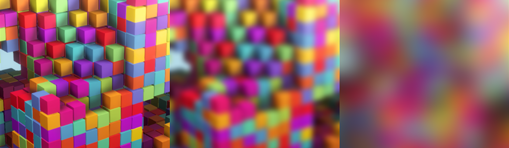

# GaussianBlurGroupShared

This is a Gaussian blur implementation I wrote in HLSL, as a compute shader in Unity.

It uses groupshared memory, which might speed up the processing. I haven't had yet time to benchmark it against exact same blur without the groupshared memory implementation. Anyway, groupshared memory was the main focus of this as a learning experience/study case and this is not obviously intended for production use.

Using groupshared memory requires some thinking and makes it a bit tricker to implement things, as one needs to fit the data to a quite small memory space (16kb per group.) So in practice this sets some limits/requirements how you can access the data (when you do things like blurs, edge finding etc.) You probably have to do things in tiles or lines and then store the edge padding too (blur radius in this case.)

## Features

- This test setup has just a simple scene and you can adjust the parameters in the Inspector
- You can select an image to test the Gaussian blur on
- Processed image is blitted to the screen
- Blur settings are shown on screen
- Blur kernel size can be adjusted in the Inspector
- I implemented this Gaussian blur as separable (x and y dimensions rendered in separate steps which reduces the rendering cost considerably.)

## Notes

- Built in Unity 2018.4, most likely works on later versions
- This implementation assumes a square image
